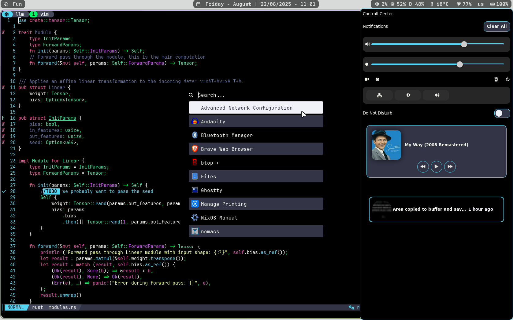

# 🌟 Lucas' Dotfiles


A modern, declarative desktop environment configuration using NixOS with Hyprland, featuring a custom dark theme inspired by Dracula with neon accents.

## 🖥️ Desktop Preview


*Custom wallpaper and themed desktop environment*

## ✨ Key Features

- **🚀 Wayland-First**: Complete Wayland setup with Hyprland compositor
- **🎨 Custom Dark Theme**: Dracula-inspired color scheme with neon accents throughout all applications
- **🐚 Modern Shell**: Nushell with custom functions and smart completion
- **📦 Reproducible**: Fully declarative NixOS configuration with flakes
- **🔧 Development-Ready**: Pre-configured development environment with LSP, formatting, and debugging
- **⚡ Performance**: Optimized for speed with zram, automatic garbage collection, and efficient workflows

## 🛠️ Core Technologies

### **System Foundation**
- **NixOS 25.05**: Declarative Linux distribution
- **Hyprland**: Dynamic tiling Wayland compositor
- **Home Manager**: Declarative dotfiles management
- **Stylix**: System-wide theming framework

### **Shell & Terminal**
- **Nushell**: Modern shell with structured data and powerful scripting
- **Ghostty**: GPU-accelerated terminal with Wayland support
- **Starship**: Fast, customizable cross-shell prompt
- **Tmux**: Terminal multiplexer with custom theme
- **Carapace**: Universal shell completion engine

### **Development Environment**
- **Neovim/NVF**: Highly configured editor with LSP support
- **VS Code**: Secondary editor with essential extensions
- **Languages**: Rust, Python, Nix, TypeScript, Bash, Lua support
- **Git**: Advanced configuration with delta for beautiful diffs
- **Jujutsu**: Next-generation VCS for complex workflows
- **Direnv**: Automatic environment loading

### **Desktop Applications**
- **Waybar**: Highly customizable status bar with system monitoring
- **SwayNC**: Modern notification daemon with control center
- **Rofi**: Application launcher and window switcher
- **Brave**: Privacy-focused browser with Wayland support
- **Zathura**: Vim-like document viewer

### **Media & Utilities**
- **OBS Studio**: Screen recording and streaming
- **Audacity**: Audio editing
- **Nomacs**: Fast image viewer
- **PostgreSQL + pgAdmin**: Database development stack

## 🎨 Custom Theme

The configuration features a custom **Dark Dracula** theme with neon accents:

### Color Palette
```nix
base16Scheme = {
  base00 = "000000";    # Pure black background
  base01 = "333547";    # Dark grey secondary
  base02 = "44475a";    # Medium grey
  base03 = "6272a4";    # Light grey
  base04 = "62d6e8";    # Cyan blue
  base05 = "f8f8f2";    # Foreground white
  base06 = "f1f2f8";    # Light background
  base07 = "f3f981";    # Bright yellow
  base08 = "ea51b2";    # Hot pink
  base09 = "d95bff";    # Purple
  base0A = "3ff0a9";    # Neon green-blue
  base0B = "ebff87";    # Neon yellow
  base0C = "a1efe4";    # Cyan
  base0D = "51d6f4";    # Sky blue
  base0E = "ff55a1";    # Magenta
  base0F = "00f769";    # Electric green
}
```

This theme is consistently applied across:
- **Terminal and Shell**: Nushell, Tmux, Starship prompt
- **Editor**: Neovim with matching syntax highlighting
- **Desktop**: Waybar, notifications, window decorations
- **Applications**: All GUI applications follow the same palette

## 🚀 Installation

### Prerequisites
- NixOS installed on your system
- Git configured
- Basic familiarity with Nix flakes

### Quick Start

1. **Clone the repository**
   ```bash
   git clone https://github.com/yourusername/dotfiles ~/.dotfiles
   cd ~/.dotfiles
   ```

2. **Build and switch to the configuration**
   ```bash
   # For system configuration (requires sudo)
   sudo nixos-rebuild switch --flake .#luctop

   # For home manager configuration
   home-manager switch --flake .
   ```

3. **Reboot to ensure all services start correctly**
   ```bash
   sudo reboot
   ```

### Host-Specific Installation

For different machines, update the hostname in `flake.nix` and create a corresponding host configuration:

```bash
# Copy and modify an existing host config
cp -r hosts/luctop hosts/yourhostname
# Edit the configuration as needed
sudo nixos-rebuild switch --flake .#yourhostname
```

## ⚙️ Customization

### Adding New Packages
Add packages to `home-manager/home-packages.nix`:
```nix
home.packages = [
  pkgs.your-package
  # ... existing packages
];
```

### Modifying the Theme
Edit the color scheme in `home-manager/modules/stylix.nix`:
```nix
base16Scheme = {
  base00 = "your-color";  # Modify colors as desired
  # ...
};
```

### Shell Aliases and Functions
Add custom aliases in `home-manager/modules/shell/alias.nix`:
```nix
{
  myalias = "my command";
  # ... existing aliases
}
```

Add Nushell functions in `home-manager/modules/shell/extraConfig.nu`.

## 🔧 Useful Aliases & Functions

The configuration includes many productivity-enhancing aliases:

- `tx <path>` - Create/attach to a tmux session for any directory
- `gpj` - Fuzzy-find and open projects in tmux
- `notes` - Quick access to notes directory in tmux
- `rs` - Rebuild home-manager configuration
- `ro <hostname>` - Rebuild NixOS system configuration
- `lz` - Launch lazygit for version control
- `se` - Open files with sudo in editor

## 🎯 Development Workflow

### Language Support
- **Rust**: Complete development environment with rust-analyzer, cargo integration
- **Python**: Virtual environment support, type checking with pyright
- **Nix**: Full LSP support with nixd, formatting with alejandra
- **Web**: TypeScript, HTML, CSS with proper LSP configuration

### Project Templates
Quick start new projects with:
```bash
nix flake init -t ~/.dotfiles#rust    # Rust project
nix flake init -t ~/.dotfiles#python  # Python project
```

## 🤝 Contributing

Contributions are welcome! Please feel free to:
- Report bugs or issues
- Suggest improvements
- Submit pull requests
- Share your own configurations

## 📚 Resources

- [NixOS Manual](https://nixos.org/manual/nixos/stable/)
- [Home Manager Options](https://rycee.gitlab.io/home-manager/options.html)
- [Hyprland Wiki](https://wiki.hyprland.org/)
- [Nushell Documentation](https://www.nushell.sh/)

---

*Built with ❤️ and ☕ using NixOS*
